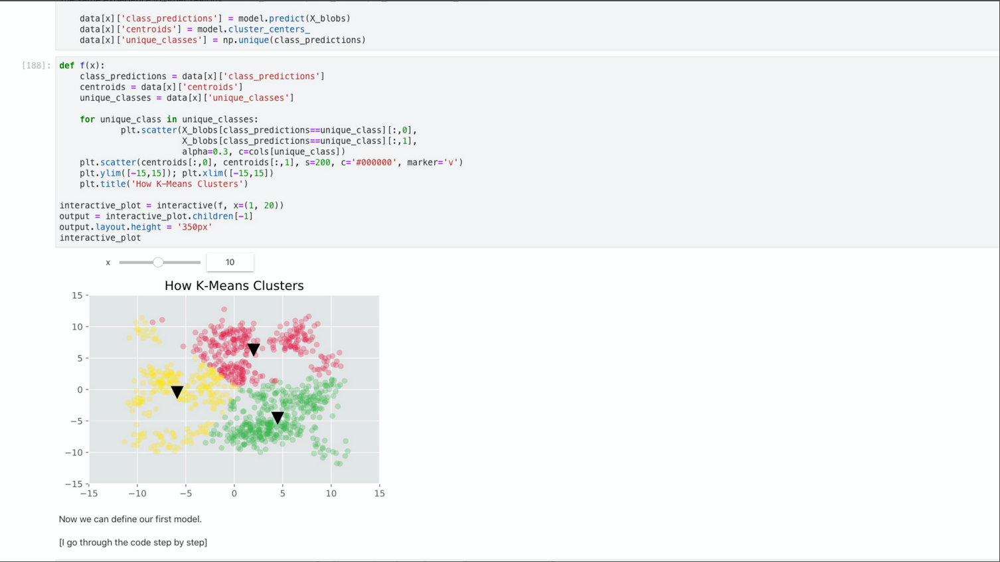
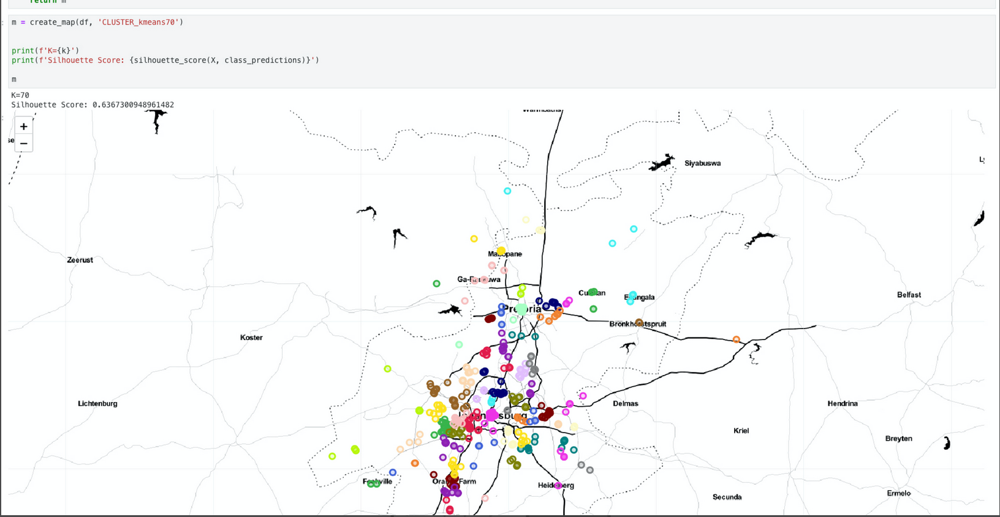
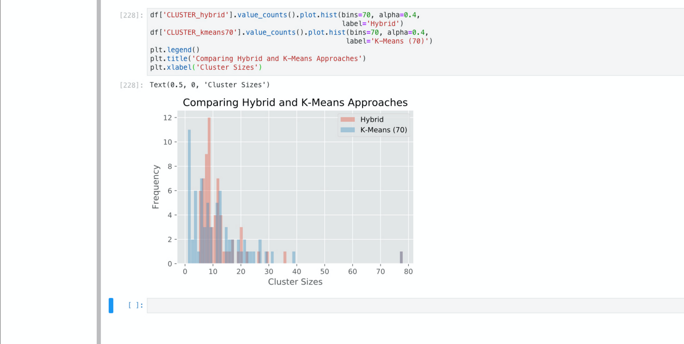

# Clusturing-Geological-Data-Intelligently-in-Python-GAURAV-KUMAR_myfinalProject-
<h4>In this project, I worked on the following things: </h4> 
<ul>
  <li>
     Preprocess and clean geolocation data
  </li>
   <li>
     Visualize dataset interactively
  </li>
   <li>
     Evaluate the strength of a clustering algorithm's result
  </li>
   <li>
     How the K-Means algorithm works and how to use it
  </li>
   <li>
     How to use DBSCAN and what its shortcomings are
  </li>
   <li>
     How to improve DBSCAN with HDBSCAN
  </li>
   <li>
     Addressing and classifying outliers into existing clusters using K-Nearest Neighbor
  </li>
 
 
 
